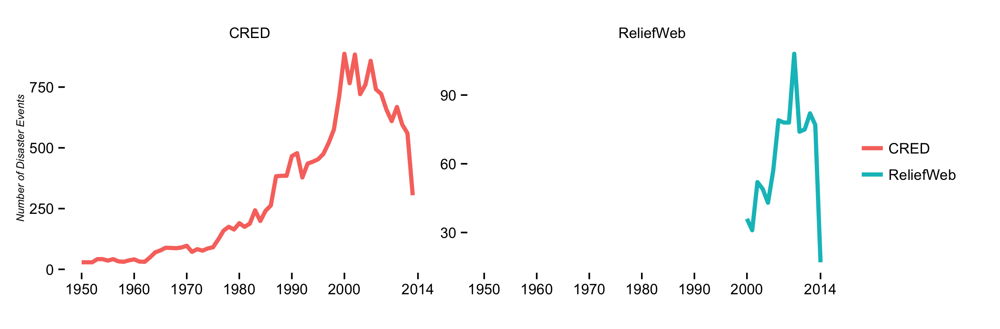
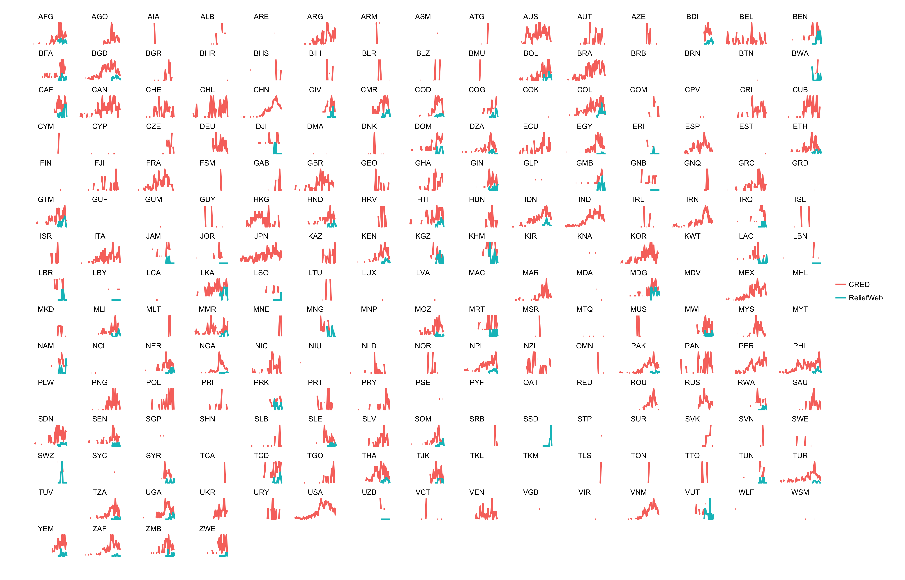
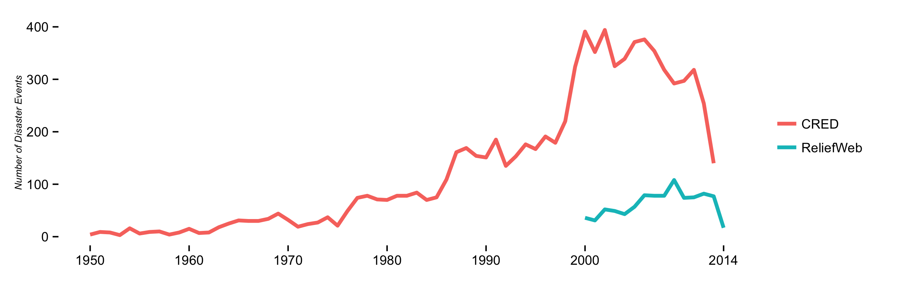

Comparing CRED and ReliefWeb Disaster Measurements
==================================================

ReliefWeb makes available disaster events in real-time, while CRED goes through multi-month release periods. Comparing both sources could be valuable to understand how they complement each other. This repository contains some early exploration.

#### Comparing both sources globally.
CRED has a much greater time-series than ReliefWeb and ReliefWeb does not register as many disaster events as CRED does.

#### Comparing both sources on a free scale.
However, if we compare both sources on a free scale we can see that they resemble similar levels of intensity: both register more disaster events in similar periods of time.

#### Comparing both sources on each country.
If we make that same comparison at the country level, we can see that in a few countries the relationship betwen sources is more comparable than in other countries. ReliefWeb, in particular, does not register events in the majority of countries that CRED does.

#### Comparing only the countires that both have data
If we compare only the countries in which both CRED and ReliefWeb have data we have a fairer comparison. CRED has data about **215** countries while ReliefWeb only has data about **69** countries. If we compare then only in the 69 overlapping countries, the plot looks slightly different and a bit more comparable in terms of scale.
