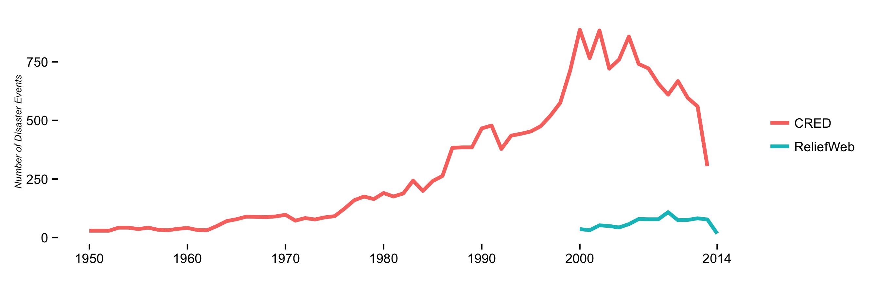

Comparing CRED and ReliefWeb Disaster Measurements
==================================================

ReliefWeb makes available disaster events in real-time, while CRED goes through multi-month release periods. Comparing both sources could be valuable to understand how they complement each other. This repository contains some early exploration.

### Comparing both sources globally.

### Comparing both sources on a free scale.

### Comparing both sources on each country.
